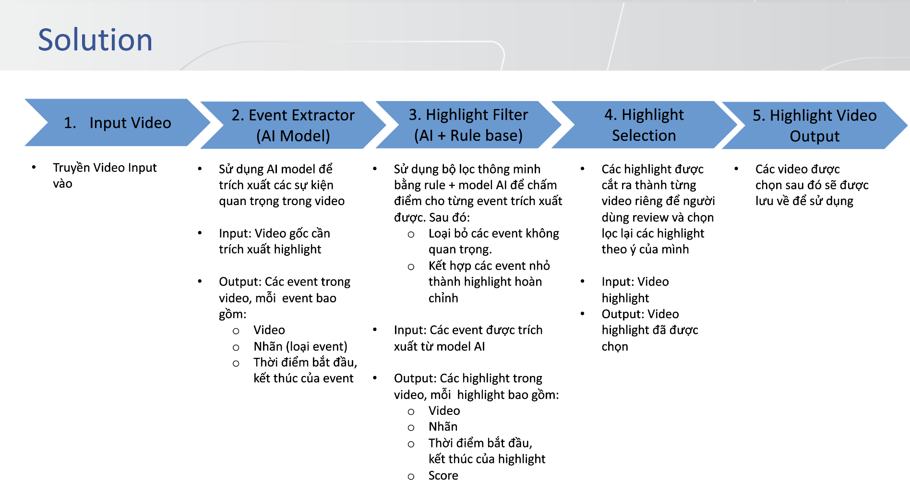
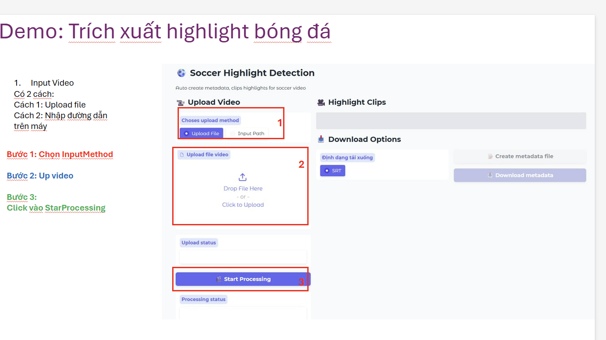
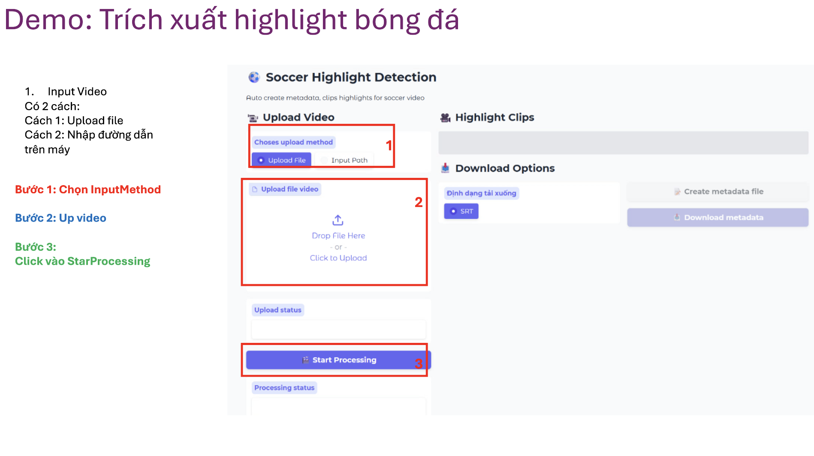
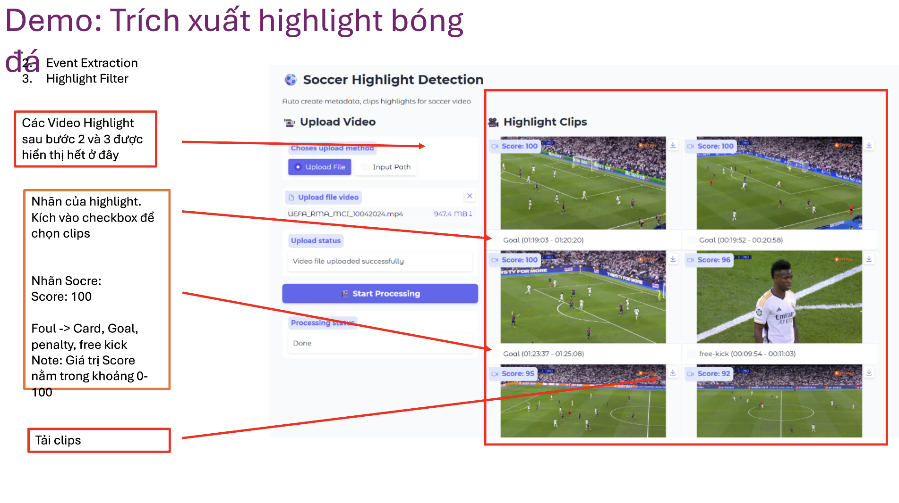
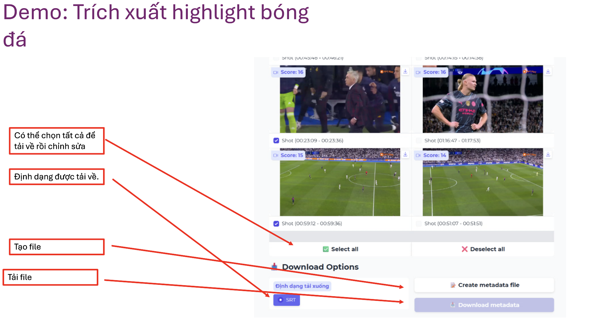
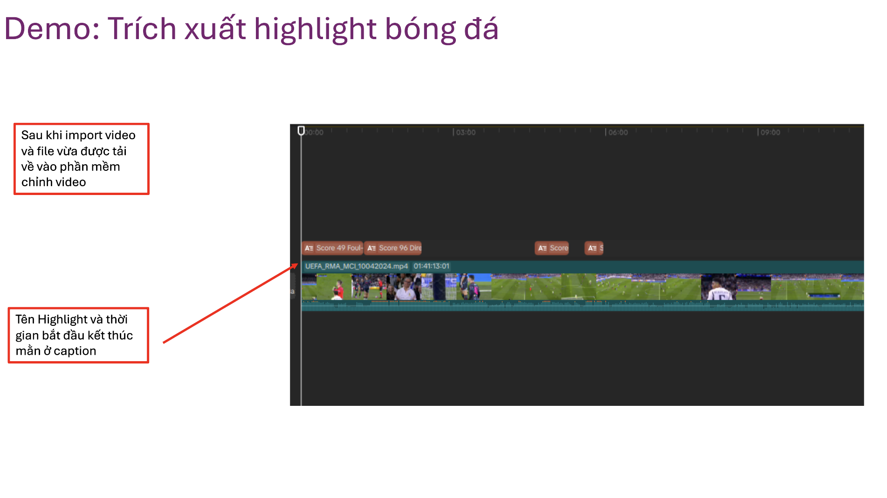

# Soccer Highlight Generator ⚽


End-to-end automated highlight clip generation for full soccer matches. Built for sports analysts, broadcasters, and football fans who want to extract ranked, key moments (goals, shots, passes) in minutes instead of manually scrubbing through hours of footage.



## 📸 How It Works

Explore the step-by-step process of our automated soccer highlight generation:

| Step 1: Video Upload | Step 2: Processing & Analysis |
|:---:|:---:|
|  |  |
| *Intuitive Gradio Web UI for easy video uploads.* | *Real-time visualization of the AI inference pipeline.* |

| Step 3: Rule-Based Scoring | Step 4: Final Highlight Reels |
|:---:|:---:|
|  |  |
| *Exhaustive ranking of every spotted moment.* | *High-quality, ready-to-share ranked clips.* |

| Step 5: Video Playback |
|:---:|
|  |
| *Direct playback and review of clips within the interface.* |


### 🛠️ Technical Deep Dive
For detailed insights into the model's inference performance and pipeline state, refer to our technical logs:
- **[Inference Detail Report 1 (PDF)](assets/inference_detail_1.pdf)**: Detailed breakdown of action spotting timestamps.
- **[Inference Detail Report 2 (PDF)](assets/inference_detail_2.pdf)**: Analysis of camera segmentation and scoring logic.

## ✨ Key Features

- **Spot actions automatically**: Detect critical on-ball actions like shots, passes, crosses, and tackles using a highly trained action-spotting neural network.
- **Understand camera context**: Employ CALF segmentation to classify views (main camera, close-up, goal-line) to ensure highlights are visually appealing.
- **Rank the best moments**: Utilize a sophisticated rule-based scoring engine to evaluate and rank clips based on action density and context.
- **Generate ready-to-share clips**: Automatically cut, trim, and merge the highest-ranked moments into a continuous highlight reel.
- **Process via REST API**: Integrate seamlessly into existing media pipelines using the robust FastAPI backend.
- **Interact via Web UI**: Upload videos and configure parameters easily using the built-in Gradio interface.
- **Accelerate with GPU Docker**: Leverage full NVIDIA GPU pass-through in an isolated container for massive inference speedups.

## 🚀 Quick Start

Generate your first highlight reel from a match video.

1. **Install environment and dependencies**:
   ```bash
   git clone https://github.com/your-repo/soccer-highlight.git
   cd soccer-highlight
   python3 -m venv sh_venv && source sh_venv/bin/activate
   pip install torch torchvision --index-url https://download.pytorch.org/whl/cu128
   pip install -r requirements.txt
   ```

2. **Download Weights**:
   Ensure you place the downloaded weights in the `weight/` directory (action, ball, camera, resnet folders).

3. **Run the CLI pipeline**:
   ```bash
   python3 main.py ./data/sample_match.mp4
   ```

**Expected Output:**
The system will extract features, detect actions, score them, and output:
- A ranked JSON list at `highlight_results/sample_match_highlights.json`.
- Automatically trimmed `.mp4` video files in the `clips/` directory containing the top 5 highlights of the match!

## 📦 Installation

### Method 1: Docker (GPU Optimized)
This is the recommended approach to avoid PyTorch/CUDA version conflicts.
```bash
# Build the image
docker-compose build

# Run the container (starts both API on 8000 and Gradio on 7860)
./docker-run.sh
```

### Method 2: Local Setup
```bash
python3 -m venv env
source env/bin/activate
pip install -r requirements.txt
```

## 💡 Usage Examples

### Example 1: Full Pipeline via CLI
**Scenario:** You have a 90-minute match and want to run the full pipeline in the background.
```bash
python3 main.py path/to/full_match.mp4 --top-k 10 --merge-clips
```
**Output:** Analyzes the match, selects the top 10 moments, and merges them into a single `final_highlights.mp4` video.

### Example 2: Using the Gradio Web UI
**Scenario:** You want a visual interface to upload videos and tweak scoring parameters.
```bash
cd app_v2
python3 ui.py
```
**Output:** Starts a web server. Navigate to `http://localhost:7860`, upload your video, set the rules (e.g., "prioritize shots over passes"), and click "Generate". The UI will display the resulting video.

### Example 3: API Integration
**Scenario:** Trigger highlight generation from a separate backend service.
```bash
# Start the API server
cd app_v2 && uvicorn server:app --host 0.0.0.0 --port 8000

# Send a POST request
curl -X POST "http://localhost:8000/process" \
     -H "Content-Type: application/json" \
     -d '{"video_path": "/data/match.mp4", "clip_count": 5}'
```
**Output:** Returns a JSON response with job status and paths to the generated clip artifacts.

### Example 4: Evaluating Custom Rules
**Scenario:** You want to tweak the scoring logic to give a higher penalty to clips with too many close-up shots (which disrupt the flow of play).
Modify `rules/scoring.py` to adjust the camera penalty weights, then rerun the rule engine purely on existing predictions without re-running the heavy neural networks:
```bash
python3 -m rules.evaluate --predictions pipeline_output/match/preds.json
```

## 🛠️ Troubleshooting

- **`CUDA error: out of memory` during ResNet extraction**
  - *Cause:* The batch size for feature extraction is too large for your GPU.
  - *Fix:* Decrease the batch size in `inference/config.yaml` from 64 to 16 or 8.
- **No clips generated / Empty JSON**
  - *Cause:* The model weights are missing or placed in the wrong directory.
  - *Fix:* Verify that `weight/action/`, `weight/camera/`, etc., contain the `.pt` files.
- **FFmpeg Error during clip creation**
  - *Cause:* FFmpeg is not installed on the host system.
  - *Fix:* Run `sudo apt-get install ffmpeg` (Ubuntu) or use the Docker image which has it pre-installed.

## 📚 Documentation Links

Maximize your clip generation workflow by diving deep into our core modules:

- **[Action Spotting Architecture Overview](./docs/ACTION_SPOTTING.md)**
  Discover the neural network design that powers our automated moment detection. This guide details the data flow as the model extracts spatiotemporal features from full matches to accurately spot shots, passes, and tackles at lightning speed.

- **[CALF Camera Segmentation](./docs/CAMERA_VIEWS.md)**
  Understand how our system analyzes visual context to ensure broadcast-quality highlights. Learn about the CALF segmentation approach that classifies camera views via sophisticated API payloads to automatically filter out visually disruptive angles.

- **[Rule Engine Configuration](./docs/RULE_ENGINE.md)**
  Take complete control over how highlights are scored and ranked. Uncover exhaustive hyperparameter tuning options for the sophisticated rule-based engine, allowing you to prioritize specific action types and perfectly tailor the final reel.

## 🤝 Contributing

We welcome pull requests! 
1. Fork the repo.
2. Create a feature branch (`git checkout -b feature/VAR-detection`).
3. Commit your changes (`git commit -m 'Add VAR review detection'`).
4. Push to the branch (`git push origin feature/VAR-detection`).
5. Open a Pull Request.

Please ensure your code passes standard `flake8` linting and includes test coverage for new rules.

## 📄 License

This project is licensed under the MIT License - see the [LICENSE](./LICENSE) file for details.
