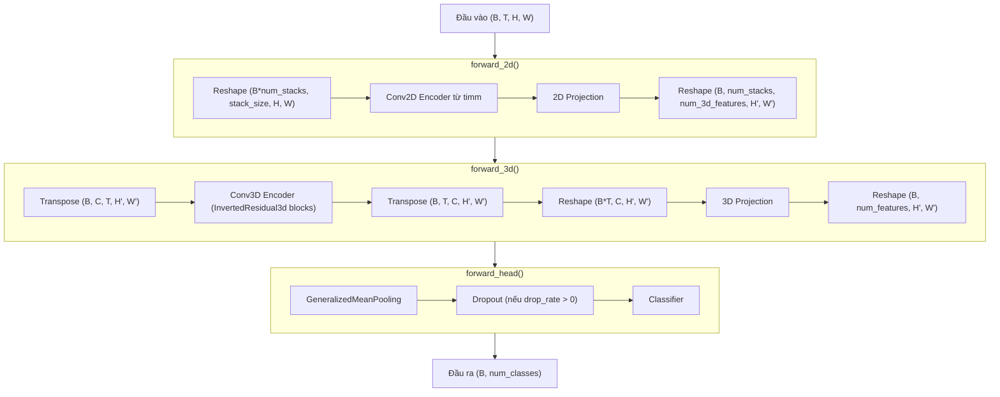
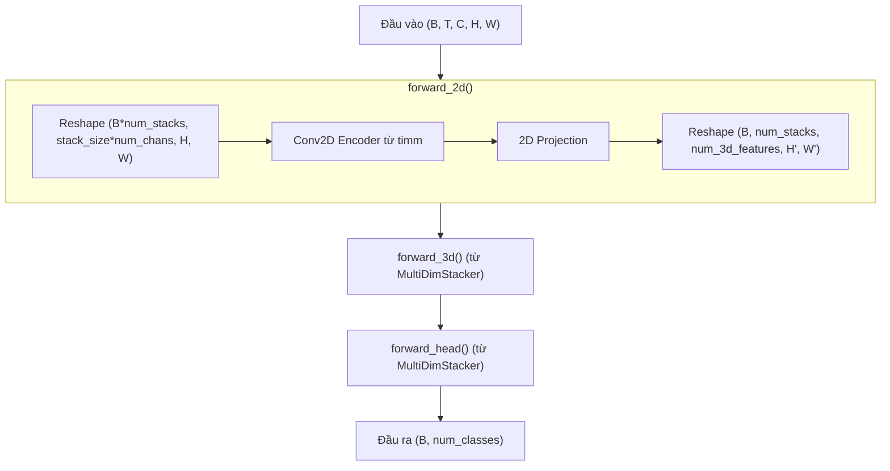
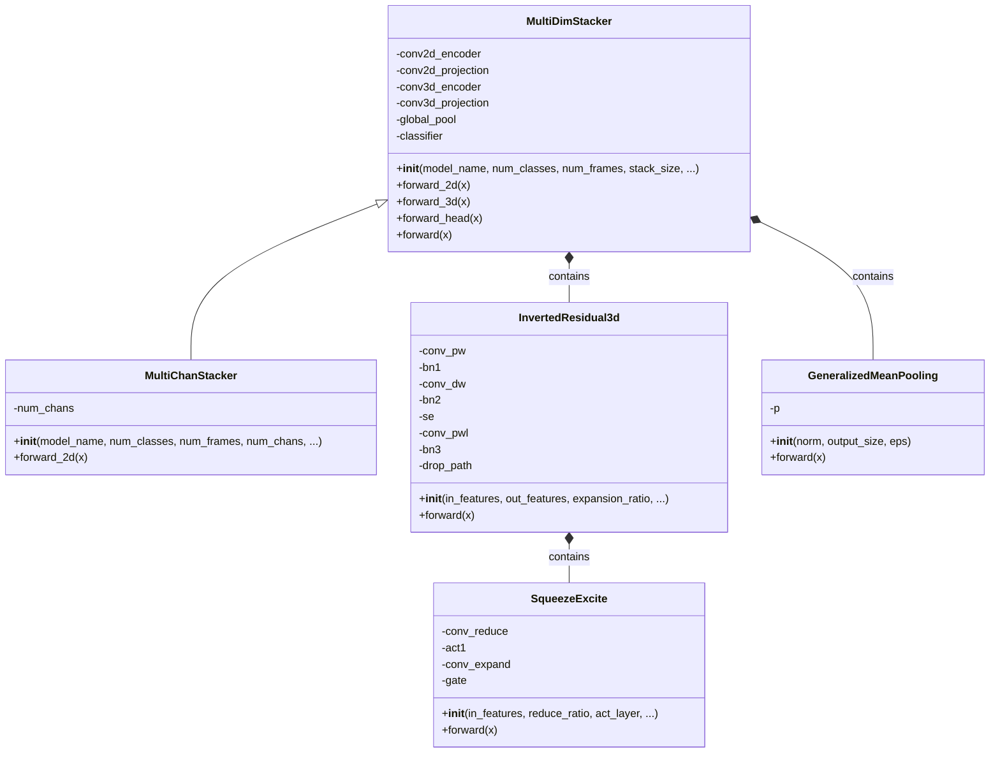
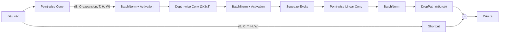

# Kiến trúc Model: MultiDimStacker và MultiChanStacker

## Tổng quan

Đây là các model được thiết kế để xử lý dữ liệu video trong task nhận diện hành động bóng đá. Các model kết hợp xử lý 2D và 3D để trích xuất thông tin thời gian từ dữ liệu video.

## MultiDimStacker

`MultiDimStacker` là một mô hình kết hợp xử lý 2.5D và 3D để trích xuất thông tin thời gian từ dữ liệu video một cách hiệu quả.

### Các tham số chính

| Tham số | Mô tả |
|---------|-------|
| model_name | Tên mô hình backbone từ thư viện timm |
| num_classes | Số lớp cần phân loại |
| num_frames | Số frames đầu vào (mặc định: 15) |
| stack_size | Số frames trong một stack (mặc định: 3) |
| index_2d_features | Chỉ số của feature map từ backbone 2D (mặc định: 4) |
| pretrained | Sử dụng pre-trained weights hay không (mặc định: False) |
| num_3d_blocks | Số InvertedResidual3d blocks (mặc định: 2) |
| num_3d_features | Số channels của features 3D (mặc định: 192) |
| num_3d_stack_proj | Số channels sau khi projection (mặc định: 256) |
| expansion_3d_ratio | Tỷ lệ mở rộng trong InvertedResidual3d (mặc định: 6) |
| se_reduce_3d_ratio | Tỷ lệ giảm trong SqueezeExcite (mặc định: 24) |
| drop_rate | Tỷ lệ dropout (mặc định: 0) |
| drop_path_rate | Tỷ lệ drop path (mặc định: 0) |
| act_layer | Hàm activation (mặc định: "silu") |

### Luồng xử lý dữ liệu

## MultiChanStacker

`MultiChanStacker` kế thừa từ `MultiDimStacker` và được thiết kế để xử lý frames RGB (hoặc với bất kỳ số kênh màu nào).

### Tham số bổ sung

| Tham số | Mô tả |
|---------|-------|
| num_chans | Số kênh màu của mỗi frame (mặc định: 3 cho RGB) |

### Sự khác biệt so với MultiDimStacker

- Đầu vào có dạng `(B, T, C, H, W)` với C là số kênh màu
- Ghi đè forward_2d để xử lý nhiều kênh màu
- Định cấu hình conv2d_encoder với `in_chans=stack_size * num_chans`

### Luồng xử lý dữ liệu

## Các thành phần chính

## Chi tiết kích thước đầu vào/đầu ra

```mermaid
flowchart LR
    subgraph MultiDimStacker
        input1["Đầu vào (2, 15, 736, 1280)"] --> reshape1["Reshape (10, 3, 736, 1280)"]
        reshape1 --> encoder2d["Conv2D Encoder"] 
        encoder2d --> features1["Features (10, 192, 23, 40)"]
        features1 --> projection2d["2D Projection"]
        projection2d --> features2["Features (10, 192, 23, 40)"]
        features2 --> reshape2["Reshape (2, 5, 192, 23, 40)"]
        reshape2 --> transpose1["Transpose (2, 192, 5, 23, 40)"]
        transpose1 --> encoder3d["Conv3D Encoder"]
        encoder3d --> features3["Features (2, 192, 5, 23, 40)"]
        features3 --> transpose2["Transpose (2, 5, 192, 23, 40)"]
        transpose2 --> reshape3["Reshape (10, 192, 23, 40)"]
        reshape3 --> projection3d["3D Projection"]
        projection3d --> features4["Features (10, 256, 23, 40)"]
        features4 --> reshape4["Reshape (2, 1280, 23, 40)"]
        reshape4 --> pool["GlobalPool"]
        pool --> features5["Features (2, 1280)"]
        features5 --> classifier["Classifier"]
        classifier --> output1["Output (2, num_classes)"]
        
        input1 --> reshape1
        reshape1 --> encoder2d
        encoder2d --> features1
        features1 --> projection2d
        projection2d --> features2
        features2 --> reshape2
        reshape2 --> transpose1
        transpose1 --> encoder3d
        encoder3d --> features3
        features3 --> transpose2
        transpose2 --> reshape3
        reshape3 --> projection3d
        projection3d --> features4
        features4 --> reshape4
        reshape4 --> pool
        pool --> features5
        features5 --> classifier
        classifier --> output1
    end
  
    subgraph MultiChanStacker
        input2["Đầu vào (2, 15, 3, 736, 1280)"] --> reshape5["Reshape (10, 9, 736, 1280)"]
        reshape5 --> encoder2d2["Conv2D Encoder"]
        encoder2d2 --> features6["Features (10, 192, 23, 40)"]
        features6 --> projection2d2["2D Projection"]
        projection2d2 --> features7["Features (10, 192, 23, 40)"]
        features7 --> reshape6["Reshape (2, 5, 192, 23, 40)"]
        reuse["Sử dụng luồng 3D của MultiDimStacker"]
        
        input2 --> reshape5
        reshape5 --> encoder2d2
        encoder2d2 --> features6
        features6 --> projection2d2
        projection2d2 --> features7
        features7 --> reshape6
        reshape6 --> reuse
    end
```

## Quá trình xử lý trong InvertedResidual3d

## Tổng kết

- **MultiDimStacker**: Xử lý frames grayscale, kết hợp xử lý 2D và 3D để trích xuất thông tin thời gian.
- **MultiChanStacker**: Mở rộng từ MultiDimStacker, xử lý frames đa kênh (ví dụ: RGB).
- **Đặc điểm chính**: Sử dụng backbone từ timm cho encoder 2D, kết hợp với các InvertedResidual3d blocks cho xử lý 3D.
- **Ứng dụng**: Phát hiện hành động trong video bóng đá. 